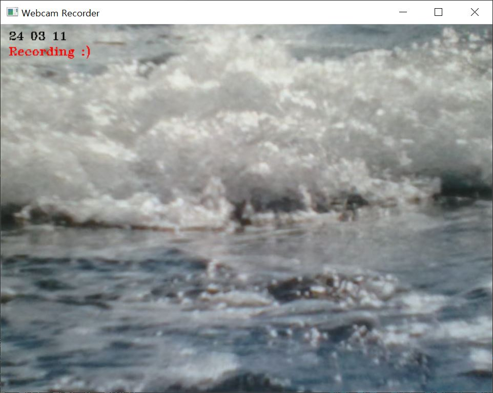

# 웹캠 녹화기

이 코드는 OpenCV를 사용하여 웹캠에서 비디오를 캡처하는 간단한 웹캠 녹화기를 구현합니다.
또한 날짜 모드를 활성화하여 각 비디오에 현재 날짜를 표시할 수 있습니다.

## 기능

- 웹캠으로부터 비디오를 실시간으로 캡처합니다.
- 스페이스바를 눌러 녹화를 시작하고 중지할 수 있습니다.
- 엔터 키를 눌러 날짜 모드를 활성화하여 현재 날짜를 표시할 수 있습니다.
- ESC 키를 눌러 프로그램을 종료할 수 있습니다.

## 사용 방법

1. 코드를 실행하면 웹캠이 시작되고, 프레임이 표시됩니다.
2. 스페이스바를 눌러 녹화를 시작하고 중지할 수 있습니다. 녹화 중인지 여부는 프레임 상단에 "Recording :)" 텍스트로 표시됩니다.
3. 엔터 키를 눌러 날짜 모드를 활성화하여 현재 날짜를 표시할 수 있습니다.
4. ESC 키를 눌러 프로그램을 종료합니다.

**참고:**

- 녹화 중에 표시되는 "Recording :)" 텍스트는 저장되는 영상에 나타나지 않습니다.
- 날짜 모드가 활성화되면 저장되는 영상에 현재 날짜가 표시됩니다.
- 또한, 날짜 모드는 필름 카메라의 데이터백 기능과 유사합니다.

## 이미지 추가 설명:

1. **실행 시 보이는 화면:**
   

   - 프로그램을 실행하면 웹캠이 시작되고 프레임이 표시됩니다.

2. **녹화 모드 화면:**
   

   - 녹화 중인 상태에서는 프레임 상단에 "Recording :)" 텍스트가 표시됩니다.

3. **날짜 모드 화면:**
   
   - 날짜 모드가 활성화되면 현재 날짜가 각 프레임에 표시됩니다.
